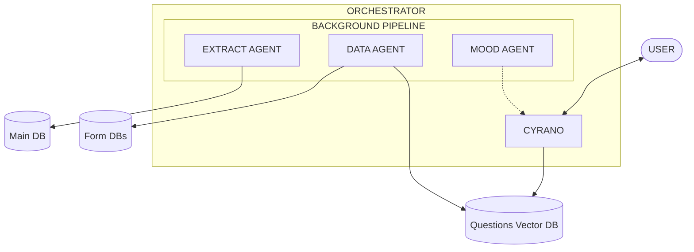

# Cyrano Agent


A multi-agent conversational AI system that captures structured data through natural dialogue. Users never see forms or databases with data collection happens invisibly through natural flowing conversation with a devote agent with information extraction, entry, and feeding of needed info, follow-up and guidance to the front end talk agent occuring through an Agno agentic system in the background. 

## The Problem with Forms

Digital tools ask people to adapt to technology: fill out forms, answer structured questions, log data into systems designed for desk workers. But people give better information in natural conversation than they do on forms—more detail, more context, more of the connections between things.

This mismatch hits hardest for populations that current digital tools exclude by design:

- A patient describing symptoms to a health worker
- A caregiver reporting on a loved one's condition
- A smallholder farmer tracking crops and inputs
- A social worker conducting a home visit
- A refugee explaining their situation
- A non-literate artisan negotiating with a buyer

For these users, the answer is not a simpler interface—it is no interface at all. Just conversation.

## How It Works

Cyrano solves this with four specialized Claude agents. The front-of-house agent focuses entirely on being a good conversation partner, while background agents extract structured facts, route them to databases, and identify gaps to fill naturally in future conversations. The user shares information without knowing they just populated a database field.



**Four Specialized Agents:**

| Agent | Role |
|-------|------|
| **Cyrano** | Front-of-house conversational partner. Listens, follows up naturally, never advises or interrogates. |
| **Extract Agent** | Pulls structured facts from conversation into Main DB. |
| **Data Agent** | Routes facts to domain-specific databases, generates natural-language questions for gaps. |
| **Mood Agent** | Monitors engagement, nudges Cyrano to adjust pace or wrap up warmly. |

## Features

- Natural conversation that feels like talking to a person, not a system
- Invisible data capture—no forms, no structured questions
- Vector-based question surfacing when conversation drifts near data gaps
- Mood-aware engagement that respects the user's energy and attention
- Swappable domain databases as integration points for external products
- Local-first: SQLite + LanceDB, no Docker required

## Use Cases

The pattern applies anywhere people communicate naturally but systems need structured records:

| Domain | Example |
|--------|---------|
| **Healthcare** | Patient intake, symptom tracking, medication adherence |
| **Caregiving** | Daily status updates, incident reporting, care coordination |
| **Agriculture** | Crop planning, input tracking, yield recording |
| **Social Services** | Needs assessments, case management, benefit eligibility |
| **Field Research** | Surveys, interviews, longitudinal data collection |

## Current Implementation

This repository ships with an **agriculture reference implementation**—a conversational system for smallholder farmers to track fields, crops, inputs, and yields. The domain-specific components (database schemas, question banks, personality tuning) can be swapped out for other use cases.

## Quick Start

### Prerequisites

- Python 3.12+
- Anthropic API key

### Installation

```bash
cd agno-server
pip install -r requirements.txt
cp .env.example .env  # Add your ANTHROPIC_API_KEY
python -m db.init_db
```

### Run

```bash
# CLI conversation
python -m main [user_id] [session_id]

# Web API server (port 8080)
python run_server.py

# Monitoring dashboard (port 7777)
python -m server
```

## External Services

| Service | Purpose |
|---------|---------|
| **Anthropic API** | Claude LLM for all agents |
| **Hugging Face Hub** | Embedding model (downloaded once, cached locally) |

All other dependencies run locally with no external network calls.

## Project Structure

```
cyrano-agent/
├── agno-server/          # Python backend
│   ├── agents/           # Four Claude agents + orchestrator
│   ├── api/              # FastAPI web server
│   ├── tools/            # Agent tool functions
│   ├── db/               # Database models
│   └── config/           # Settings and logging
├── ios-client/           # iOS app (Swift)
├── web-client/           # Web frontend
└── _ref/                 # Design docs and specifications
```

## Technical Highlights

- Multi-agent orchestration with Claude
- Agno framework for agent persistence and tooling
- Vector similarity search for contextual question surfacing
- Background processing with ThreadPoolExecutor
- SSE streaming for real-time responses

## License

MIT

## Acknowledgments

- Built with [Agno](https://github.com/agno-ai/agno) agent framework
- Powered by [Claude](https://anthropic.com) from Anthropic
- Embeddings via [Sentence Transformers](https://www.sbert.net/)
