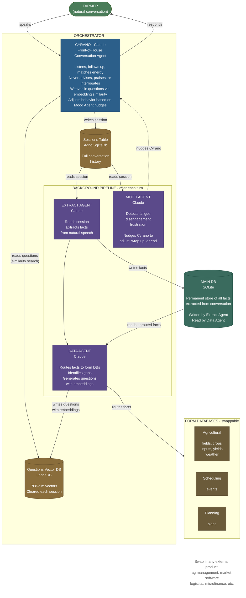

# Cyrano System Architecture

```mermaid
graph TB
    Farmer(["FARMER\n(natural conversation)"])

    subgraph Orchestrator["ORCHESTRATOR"]

        Cyrano["CYRANO - Claude\nFront-of-House Conversation Agent\n\nListens, follows up, matches energy\nNever advises, praises, or interrogates\nWeaves in questions via embedding similarity\nAdjusts behavior based on Mood Agent nudges"]

        QuestionsDB[("Questions Vector DB\nLanceDB\n\n768-dim vectors\nCleared each session")]

        SessionsDB[("Sessions Table\nAgno SqliteDb\n\nFull conversation\nhistory")]

        subgraph Pipeline["BACKGROUND PIPELINE - after each turn"]
            ExtractAgent["EXTRACT AGENT\nClaude\n\nReads session\nExtracts facts\nfrom natural speech"]
            DataAgent["DATA AGENT\nClaude\n\nRoutes facts to form DBs\nIdentifies gaps\nGenerates questions\nwith embeddings"]
            MoodAgent["MOOD AGENT\nClaude\n\nDetects fatigue\ndisengagement\nfrustration\n\nNudges Cyrano to\nadjust, wrap up, or end"]
        end
    end

    MainDB[("MAIN DB\nSQLite\n\nPermanent store of all facts\nextracted from conversation\n\nWritten by Extract Agent\nRead by Data Agent")]

    subgraph FormDBs["FORM DATABASES - swappable"]
        AgDB["Agricultural\n\nfields, crops\ninputs, yields\nweather"]
        SchedDB["Scheduling\n\nevents"]
        PlanDB["Planning\n\nplans"]
    end

    Note["Swap in any external product:\nag management, market software\nlogistics, microfinance, etc."]

    Farmer -- "speaks" --> Cyrano
    Cyrano -- "responds" --> Farmer
    Cyrano -- "reads questions\n(similarity search)" --> QuestionsDB
    Cyrano -- "writes session" --> SessionsDB
    SessionsDB -- "reads session" --> ExtractAgent
    SessionsDB -- "reads session" --> MoodAgent
    ExtractAgent --> DataAgent
    ExtractAgent -- "writes facts" --> MainDB
    MainDB -- "reads unrouted facts" --> DataAgent
    DataAgent -- "routes facts" --> FormDBs
    DataAgent -- "writes questions\nwith embeddings" --> QuestionsDB
    MoodAgent -. "nudges Cyrano" .-> Cyrano
    FormDBs --- Note

    style Farmer fill:#4a7c59,stroke:#2d5016,color:#fff
    style Cyrano fill:#2c5f8a,stroke:#1a3a5c,color:#fff
    style ExtractAgent fill:#5b4a8a,stroke:#3d2e6b,color:#fff
    style DataAgent fill:#5b4a8a,stroke:#3d2e6b,color:#fff
    style MoodAgent fill:#5b4a8a,stroke:#3d2e6b,color:#fff
    style QuestionsDB fill:#8a6d3b,stroke:#5c4726,color:#fff
    style SessionsDB fill:#8a6d3b,stroke:#5c4726,color:#fff
    style MainDB fill:#3a6b5e,stroke:#1e4a3f,color:#fff
    style AgDB fill:#6b5b3a,stroke:#4a3e26,color:#fff
    style SchedDB fill:#6b5b3a,stroke:#4a3e26,color:#fff
    style PlanDB fill:#6b5b3a,stroke:#4a3e26,color:#fff
    style Note fill:none,stroke:none,color:#666
```
